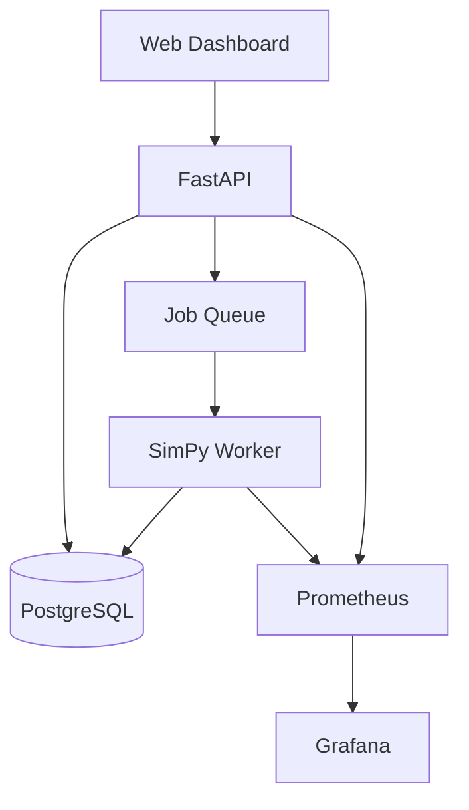

# FabFlow

FabFlow is a reproducible discrete-event simulation platform for evaluating
wafer-lot dispatching policies and Automated Material Handling System (AMHS)
constraints in a simplified semiconductor fabrication environment.

## Project Status

FabFlow is under active development. The first milestone establishes the
project structure, domain terminology, reproducible testing, and a manually
verified baseline scenario.

## Problem Statement

Semiconductor manufacturing requires production lots to move through multiple
process stages while competing for limited machines and transportation
resources. Dispatching decisions affect cycle time, work in process (WIP),
throughput, equipment utilization, queue waiting time, and on-time delivery.

FabFlow provides a controlled simulation environment for studying these
trade-offs under repeatable experimental conditions.

## Goals

- Build a reproducible discrete-event simulation of lot production and transport.
- Compare dispatching policies using identical scenarios and random seeds.
- Quantify cycle time, throughput, WIP, utilization, and on-time delivery.
- Expose experiment creation and results through a FastAPI service.
- Monitor service health and simulation results with Prometheus and Grafana.
- Run the complete application with Docker Compose and local Kubernetes.

## Planned MVP

- At least three process stages with one to three machines per stage
- Normal lots and high-priority hot lots
- Processing, queueing, transport, machine failure, and repair events
- FIFO, Shortest Processing Time, and Critical Ratio dispatching policies
- Fixed random seeds for reproducible experiments
- FastAPI endpoints for scenarios, runs, events, and metrics
- PostgreSQL persistence
- A dashboard comparing at least two policies
- Docker Compose services for the API, worker, database, Prometheus, and Grafana

## Architecture



## Repository Structure

```text
fabflow/
├── app/
│   ├── api/              # HTTP endpoints and request validation
│   ├── core/             # Configuration and shared infrastructure
│   ├── models/           # API and persistence models
│   ├── services/         # Application use cases
│   └── workers/          # Background simulation jobs
├── simulator/
│   ├── entities/         # Simulation domain entities
│   ├── events/           # Event definitions and event log
│   ├── policies/         # Dispatching policies
│   └── metrics/          # KPI calculations
├── dashboard/            # Experiment and comparison interface
├── deployments/
│   ├── compose/          # Docker Compose configuration
│   └── kubernetes/       # Kind/Kubernetes manifests
├── monitoring/           # Prometheus and Grafana configuration
├── experiments/          # Controlled experiment definitions
├── tests/                # Unit and integration tests
├── docs/                 # Architecture and domain documentation
├── pyproject.toml
└── README.md
```

## Local Development

### Requirements

- Python 3.11 or newer
- Git

### Setup

```bash
python3 -m venv .venv
source .venv/bin/activate
python -m pip install --upgrade pip
python -m pip install -e ".[dev]"
```

### Run the CLI

```bash
fabflow
```

### Run Tests

```bash
pytest
```

### Run Quality Checks

```bash
ruff check .
ruff format --check .
```

## Core Metrics

- Average and P95 cycle time
- Throughput
- Work in process
- Queue depth and waiting time
- Machine utilization
- On-time delivery rate
- Transport time and delivery-time accuracy

## Documentation

- [Domain Model](docs/domain-model.md)
- [Hand-Calculated Baseline Scenario](docs/baseline-scenario.md)

## Assumptions and Limitations

FabFlow does **not** use TSMC data or data from any real semiconductor
fabrication facility. All routes, processing times, machine configurations,
failures, transportation times, and events are simplified models based on
public manufacturing concepts or synthetic data.

The MVP does not attempt to reproduce the complete behavior of a real fab. It
excludes hundreds of detailed process steps, complete re-entrant routing,
complex recipe qualification, and real facility path optimization.

## Connection to Intelligent Manufacturing

FabFlow demonstrates how discrete-event simulation, scheduling, observability,
API design, and cloud-native deployment can be combined to evaluate
manufacturing decisions.

The project also explores conceptual similarities between manufacturing
dispatching and computing-resource scheduling, including queues, priorities,
capacity constraints, fairness, and reservations. These are design analogies;
Kubernetes and Apache YuniKorn are not presented as semiconductor AMHS
dispatching systems.

## Roadmap

1. Project foundation and hand-calculated baseline
2. Deterministic simulation engine
3. Dispatching policies and equipment reliability
4. AMHS and stocker constraints
5. FastAPI and PostgreSQL
6. Dashboard and observability
7. Docker and Kubernetes
8. Controlled experiments and portfolio packaging

## License

This project is intended for educational and portfolio purposes.
