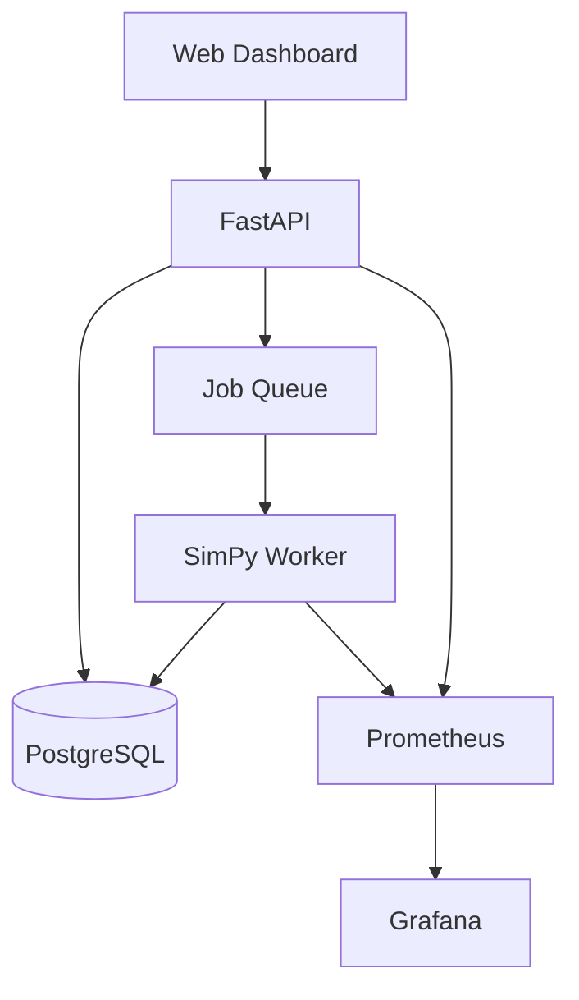

# FabFlow

FabFlow is a reproducible discrete-event simulation platform for studying
wafer-lot dispatching policies and Automated Material Handling System (AMHS)
constraints in a simplified semiconductor manufacturing environment.

The project is designed as an intelligent-manufacturing engineering portfolio
project. It emphasizes deterministic simulation, measurable scheduling
trade-offs, automated testing, API design, observability, and cloud-native
deployment.

## Project Status

FabFlow is under active development.

The current implementation provides a deterministic, single-machine,
multi-lot simulation engine built with SimPy. It includes validated domain
entities, FIFO resource queueing, structured lifecycle events, fixed-seed
execution, and automated tests.

### Implemented

- `Lot`, `ProcessStep`, `Machine`, and `Queue` domain entities
- Normal and hot lot priority classifications
- Lot and machine lifecycle status tracking
- Single-machine capacity enforcement with SimPy
- Lot arrival, queueing, processing, and completion events
- Structured in-memory event logging
- Fixed-seed simulation execution
- Deterministic baseline tests
- Pytest unit tests
- Ruff linting and formatting

### Planned

- FIFO, Shortest Processing Time, and Critical Ratio policy abstractions
- Machine failure, repair, and maintenance behavior
- KPI calculation and policy comparison reports
- Multiple process stages and machine groups
- AMHS transportation and stocker constraints
- FastAPI and PostgreSQL integration
- Dashboard and observability
- Docker Compose and Kubernetes deployment

## Problem Statement

Semiconductor manufacturing requires production lots to move through multiple
process stages while competing for limited machines and transportation
resources. Dispatching decisions affect cycle time, work in process (WIP),
throughput, equipment utilization, queue waiting time, and on-time delivery.

FabFlow provides a controlled simulation environment for studying these
trade-offs under repeatable experimental conditions. The same scenario and
random seed can be reused across dispatching policies so that results can be
compared fairly.

## Goals

- Build a reproducible discrete-event simulation of lot production and transport.
- Compare dispatching policies using identical scenarios and random seeds.
- Quantify cycle time, throughput, WIP, utilization, and on-time delivery.
- Expose experiment creation and results through a FastAPI service.
- Monitor service health and simulation results with Prometheus and Grafana.
- Run the complete application with Docker Compose and local Kubernetes.

## Planned MVP

- At least three process stages with one to three machines per stage
- Normal lots and high-priority hot lots
- Processing, queueing, transport, machine failure, and repair events
- FIFO, Shortest Processing Time, and Critical Ratio dispatching policies
- Fixed random seeds for reproducible experiments
- FastAPI endpoints for scenarios, runs, events, and metrics
- PostgreSQL persistence
- A dashboard comparing at least two policies
- Docker Compose services for the API, worker, database, Prometheus, and Grafana

## Current Simulation Flow


The current engine uses a SimPy resource to enforce machine capacity. Lots wait
for that resource in deterministic FIFO request order. Explicit dispatching
policy classes will replace this implicit behavior in a later increment.

## Target Architecture



This diagram represents the target MVP architecture. The API, database,
dashboard, monitoring, and deployment components are not part of the current
simulation-engine increment.

## Current Repository Structure

```text
fabflow/
├── simulator/
│   ├── engine.py
│   ├── entities/
│   │   ├── lot.py
│   │   ├── machine.py
│   │   ├── process_step.py
│   │   └── queue.py
│   └── events/
│       └── event.py
├── tests/
├── docs/
│   ├── baseline-scenario.md
│   └── domain-model.md
├── pyproject.toml
└── README.md
```

## Target Repository Structure

```text
fabflow/
├── app/
│   ├── api/              # HTTP endpoints and request validation
│   ├── core/             # Configuration and shared infrastructure
│   ├── models/           # API and persistence models
│   ├── services/         # Application use cases
│   └── workers/          # Background simulation jobs
├── simulator/
│   ├── entities/         # Simulation domain entities
│   ├── events/           # Event definitions and event log
│   ├── policies/         # Dispatching policies
│   └── metrics/          # KPI calculations
├── dashboard/            # Experiment and comparison interface
├── deployments/
│   ├── compose/          # Docker Compose configuration
│   └── kubernetes/       # Kind/Kubernetes manifests
├── monitoring/           # Prometheus and Grafana configuration
├── experiments/          # Controlled experiment definitions
├── tests/                # Unit and integration tests
├── docs/                 # Architecture and domain documentation
├── pyproject.toml
└── README.md
```

## Local Development

### Requirements

- Python 3.11 or newer
- Git

### Setup

```bash
python3 -m venv .venv
source .venv/bin/activate
python -m pip install --upgrade pip
python -m pip install -e ".[dev]"
```

### Verify the Project

Run all automated checks before committing changes:

```bash
ruff format --check .
ruff check .
pytest -v
```

To apply Ruff formatting automatically:

```bash
ruff format .
```

### CLI Status

The command-line simulation interface is planned for a later increment. The
current simulation engine is exercised through automated tests.

## Determinism and Reproducibility

Each simulation engine is initialized with a fixed random seed. The current
baseline contains no stochastic behavior, so its reproducibility comes from
fixed inputs and deterministic SimPy event ordering. Later increments will use
the engine-owned random generator for processing-time variation, machine
failures, and repairs.

Fair policy comparisons will use the same:

- Random seed
- Lot arrival sequence
- Processing-time samples
- Failure and repair samples
- Simulation horizon
- Machine and AMHS configuration

## Core Metrics

The completed MVP will report:

- Average and P95 cycle time
- Throughput
- Work in process
- Queue depth and waiting time
- Machine utilization
- On-time delivery rate
- Transport time and delivery-time accuracy

Metric calculation is planned for a later increment. The current engine records
the timestamps and state transitions needed to derive these measurements.

## Documentation

- [Domain Model](docs/domain-model.md)
- [Hand-Calculated Baseline Scenario](docs/baseline-scenario.md)

## Assumptions and Limitations

FabFlow does **not** use TSMC data or data from any real semiconductor
fabrication facility. All routes, processing times, machine configurations,
failures, transportation times, and events are simplified models based on
public manufacturing concepts or synthetic data.

The MVP does not attempt to reproduce the complete behavior of a real fab. It
excludes hundreds of detailed process steps, complete re-entrant routing,
complex recipe qualification, and real facility path optimization.

## Connection to Intelligent Manufacturing

FabFlow demonstrates how discrete-event simulation, scheduling, observability,
API design, and cloud-native deployment can be combined to evaluate
manufacturing decisions.

The project also explores conceptual similarities between manufacturing
dispatching and computing-resource scheduling, including queues, priorities,
capacity constraints, fairness, and reservations. These are design analogies;
Kubernetes and Apache YuniKorn are not presented as semiconductor AMHS
dispatching systems.

## Roadmap

1. Project foundation and hand-calculated baseline
2. Deterministic simulation engine
3. Dispatching policies, equipment reliability, and KPI calculation
4. AMHS and stocker constraints
5. FastAPI and PostgreSQL
6. Dashboard and observability
7. Docker and Kubernetes
8. Controlled experiments and portfolio packaging

## License

This project is intended for educational and portfolio purposes.
