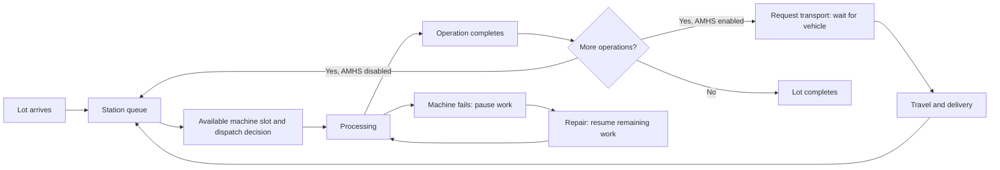

# FabFlow

FabFlow is a Python discrete-event simulator for studying dispatching decisions
in a simplified semiconductor fab. Synthetic wafer lots compete for machine
capacity across Lithography, Etching, and Inspection. Reproducible experiments
compare cycle time, throughput, on-time delivery, and equipment utilization.

**Day 1–4 are implemented and locally validated:** domain models, multi-stage
simulation, FIFO/SPT/Critical Ratio dispatching, Hot lot insertion with Normal
lot aging protection, machine failure/repair, finite AMHS vehicles, and KPI comparison reports.
API endpoints, a dashboard, and container deployment are scheduled for Day 5–7.

> This project uses synthetic data and a simplified semiconductor manufacturing
> model. It does not contain proprietary TSMC manufacturing data.

## Quick Start

Requires Python 3.12+ and Git. CI is configured for Python 3.12; the latest local
validation used Python 3.14.6. Run these commands from the repository root:

```bash
python3 -m venv .venv
source .venv/bin/activate
python -m pip install -e ".[dev]"
python -m app.simulation.demo
```

The default 20-lot, three-stage demo produces:

```text
Completed lots: 20
Average cycle time: 70.5 minutes
Throughput: 6.86 lots/hour
```

This baseline has fixed processing times and no failures. Its last lot finishes
at minute 175. To preview the five-lot scenario and its four machines:

```bash
python -m simulator.scenarios.baseline
```

The installed `fabflow` command only prints project information. Use the module
commands above to execute simulations.

## Compare Dispatching Policies

```bash
python -m app.simulation.compare
```

Export a Markdown report and JSON containing scenario inputs, the aging
threshold, unrounded KPIs, completion order, and events:

```bash
python -m app.simulation.compare --seed 42 \
  --normal-wait-threshold 60 \
  --output /tmp/fabflow-comparison.md \
  --json /tmp/fabflow-comparison.json
```

The comparison scenario contains 12 lots, including three Hot lots, with varying
processing times and due dates. It has one machine per stage and random failure
and repair behavior on the Lithography and Etching machines. Each policy runs
on fresh copies of the same inputs with the same machine failure calendars.

### Actual Simulation Results

Seed 42, Normal aging threshold 60 minutes. Cycle times are minutes; OTD is the
on-time delivery rate. These values come from the executable simulation.

| Policy | Average cycle | P95 cycle | Lots/hour | OTD |
| --- | ---: | ---: | ---: | ---: |
| FIFO | 39.77 | 69.90 | 8.01 | 41.7% |
| SPT | 36.37 | 71.74 | 8.70 | 50.0% |
| Critical Ratio | 40.21 | 66.74 | 8.70 | 41.7% |

SPT achieves the lowest average cycle time and highest OTD in this scenario,
but has the highest P95 cycle time. Critical Ratio has the lowest P95. These
results illustrate a trade-off for one workload and seed, not a universal
ranking of policies.

Each run is observed from time zero through its last completion. Different
finish times expose policies to different lengths of the same failure calendar;
this is a finite-workload comparison, not a shared fixed-horizon experiment.
See the [full generated report](docs/day3-comparison-report.md) for queue,
WIP, tardiness, utilization, and availability results.

## AMHS Vehicle Comparison (Day 4)

```bash
python -m app.simulation.amhs
python -m app.simulation.amhs --output /tmp/fabflow-amhs.md --json /tmp/fabflow-amhs.json
```

Actual results for 20 lots, three stations, and fixed 5-minute transfers:

| Vehicles | Average transport wait (min) | Average cycle (min) | Lots/hour |
| ---: | ---: | ---: | ---: |
| 1 | 53.38 | 142.75 | 5.91 |
| 3 | 2.62 | 57.05 | 12.90 |
| 6 | 0.00 | 55.00 | 12.90 |

Increasing from one to three vehicles reduces congestion. From three to six,
throughput stays the same because Etching becomes the bottleneck, although
average cycle time still improves. See the [generated report](docs/day4-amhs-report.md)
and [model and KPI definitions](docs/day4-amhs.md).

Enable transportation on any scenario:

```python
from dataclasses import replace
from simulator.entities.transport import TransportConfig

scenario = replace(scenario, transport=TransportConfig(vehicle_count=3, travel_time=5.0))
```

The default `transport=None` preserves the existing instantaneous transfers.
AMHS uses a shared FIFO vehicle pool between every pair of route operations;
Hot lot priority applies to processing queues. A completed operation releases
its machine before waiting for transport. Initial arrivals and final departures
require no transport jobs.

## Simulation Model

Each machine group has a shared station queue. When an eligible capacity slot
becomes available, the dispatcher selects a waiting lot. SimPy resources enforce
machine capacity, and a lot completes only after every route operation finishes.



The engine records `LOT_ARRIVED`, `LOT_QUEUED`, `PROCESS_STARTED`,
`PROCESS_COMPLETED`, `LOT_COMPLETED`, `MACHINE_FAILED`, and `MACHINE_REPAIRED`.
Event records include timestamps and applicable lot, machine, and step IDs.
Machine failure/repair events have `lot_id=None`. AMHS adds `TRANSPORT_REQUESTED`,
`TRANSPORT_STARTED`, and `TRANSPORT_COMPLETED`, linked by transport job ID.

### Dispatching and Hot Lots

The selected base policy applies across all machine groups:

| Policy | Selection rule: lowest value first |
| --- | --- |
| FIFO | Entry time into the current station queue |
| SPT | Processing time of the current operation |
| Critical Ratio | `(due_date - current_time) / remaining_processing_time` |

CR includes the current and all subsequent operations in remaining work and
recalculates at every dispatch. Overdue lots have negative ratios. Base policy
ties use station queue entry time, then enqueue sequence.

The engine wraps the base policy with these priority rules:

1. Normal lots waiting at least the aging threshold are selected in station FIFO order.
2. Otherwise, Hot lots are selected using the base policy.
3. Otherwise, remaining Normal lots are selected using the base policy.

The default threshold is 60 minutes and resets at each station entry. It grants
dispatch precedence, not a guaranteed start deadline: running work, outages,
and older aged lots can still delay service. Hot insertion does not interrupt
processing. This is a basic Normal lot starvation safeguard, not a general
fairness scheduler.

### Machine Failure and Repair

Reliability is optional and disabled in the baseline. `ReliabilityConfig` supports:

- Fixed outages: `outages=((3, 4), (20, 2))` fails at minute 3 for 4 minutes and
  at minute 20 for 2 minutes.
- Random reliability: `mtbf=40, mttr=3` samples exponential operational uptime
  and repair duration with those means, in minutes.

A failure takes the entire machine down, blocks new processing starts, and
pauses all active capacity slots. Repair resumes remaining work without
scrapping lots or restarting operations. Productive busy time excludes downtime.
Random uptime includes idle time and begins again after each repair.

The engine seeds independent machine random streams in sorted machine-ID order.
Identical scenarios and seeds preserve failure calendars across dispatching
policies. Same-timestamp events follow deterministic SimPy scheduling order;
the engine does not batch all events at a timestamp into one dispatch decision.

## Use the Python API

```python
from simulator.engine import SimulationEngine
from simulator.policies.spt import SPTPolicy
from simulator.scenarios.comparison import create_comparison_scenario

scenario = create_comparison_scenario(seed=42)
result = SimulationEngine(
    seed=scenario.seed,
    policy=SPTPolicy(),
    normal_wait_threshold=30.0,
).run_scenario(scenario)

print(result.kpis.average_cycle_time)
print(result.kpis.on_time_delivery_rate)
print(result.kpis.machines)
print(result.events[0])
```

Omitting `policy` uses FIFO with the same Hot lot and aging rules. Thresholds
must be finite and positive. Create a fresh engine with the scenario seed for
each run. `run_scenario()` copies input lots so the same scenario can be reused.
The original single-machine `run(lots, machine, queue)` entry point is also
supported.

To enable random reliability on a machine in an existing scenario:

```python
from dataclasses import replace

from simulator.entities.reliability import ReliabilityConfig
from simulator.scenarios.baseline import create_baseline_scenario

scenario = create_baseline_scenario()
machine = replace(scenario.machines[0], reliability=ReliabilityConfig(mtbf=40, mttr=3))
scenario = replace(scenario, machines=(machine, *scenario.machines[1:]))
```

## KPI Definitions

`result.kpis` reports metrics over `[0, result.finished_at]`, including idle time
before the first arrival. All lots complete before the run ends.

| Metric | Definition |
| --- | --- |
| Average cycle time | Mean completion time minus arrival time |
| P95 cycle time | Nearest-rank 95th percentile of completed lot cycle times |
| Throughput | Completed lots × 60 / observation minutes |
| Average WIP | Sum of cycle times / observation minutes |
| Average queue waiting time | Total station queue wait across all operations / lot count |
| Average queue depth | Total station queue wait / observation minutes |
| Peak queue depth | Maximum total queued lots across all stations in event order |
| On-time delivery | Fraction completing at or before their due date |
| Average tardiness | Mean positive lateness, including zero for on-time lots |
| Machine utilization | Productive slot-minutes / (capacity × observation minutes) |
| Machine availability | 1 − downtime / observation minutes |

Time paused on a failed machine contributes to cycle time and WIP, but not
queue waiting or productive utilization. Downtime in KPIs is clipped to the
observation window, including an unfinished repair when the last lot completes.
See [reliability and KPI details](docs/day3-reliability-kpi.md) for edge cases.

## Architecture and Repository

Current execution is entirely local:

```text
Scenario inputs → SimPy engine + dispatching + reliability + AMHS
                → Completed lots and event log
                → KPI calculator → Markdown / JSON comparison
```

```text
fabflow/
├── app/
│   ├── cli.py                  # Informational entry point
│   └── simulation/
│       ├── demo.py             # 20-lot baseline
│       ├── compare.py          # Policy comparison and exports
│       └── amhs.py             # Vehicle-count comparison and exports
├── simulator/
│   ├── engine.py               # Scheduling, lifecycle, and results
│   ├── entities/               # Lots, steps, machines, queues, scenarios, reliability
│   ├── events/                 # Immutable event records
│   ├── policies/               # FIFO, SPT, CR, and Hot lot/aging wrapper
│   ├── metrics/                # KPI calculation
│   └── scenarios/              # Baseline and comparison inputs
├── tests/                      # Unit and integration tests
├── docs/                       # Model definitions, walkthroughs, sample report
├── .github/workflows/ci.yml    # Ruff and Pytest on Python 3.12
└── pyproject.toml
```

Other `app/` packages are placeholders for future services. The planned service
architecture is Streamlit → FastAPI → simulation engine → in-memory results,
with Docker Compose running the API and dashboard.

## Testing

```bash
ruff check .
ruff format --check .
pytest -q
```

Latest local validation on Python 3.14.6:

```text
All checks passed!
57 files already formatted
90 passed
```

Tests cover route order, timestamps, capacity, repeated station visits, stable
policy ordering, Hot insertion, Normal service during continuing Hot arrivals,
failure/repair, shared random failure calendars, hand-calculated KPIs, input
isolation, AMHS capacity/FIFO, transport timestamps and KPIs, congestion, and report exports. The original no-failure baselines remain covered.

For coverage:

```bash
pytest --cov=app --cov=simulator --cov-report=term-missing
```

[GitHub Actions](.github/workflows/ci.yml) is configured to run lint, formatting,
and tests on pushes to `main` and pull requests. The results above are local;
remote CI status has not been verified for these changes.

## Roadmap

| Day | Status | Deliverable |
| --- | --- | --- |
| 1 | Complete locally | Project setup, domain models, scenario creation, test environment |
| 2 | Complete locally | Three-stage engine, capacity control, events, reproducible demo |
| 3 | Complete locally | FIFO/SPT/CR, Hot insertion and aging, reliability, KPIs, comparison exports |
| 4 | Complete locally | Limited AMHS vehicles, transport queues, transport KPIs, congestion experiments |
| 5 | Planned | FastAPI run creation, execution, result queries, validation, health checks |
| 6 | Planned | Streamlit dashboard, Docker Compose, end-to-end demo |
| 7 | Planned | Final tests, CI packaging, documentation, and portfolio materials |

## Assumptions and Limits

All times, routes, due dates, priorities, and failure parameters are synthetic.
Processing durations are fixed. The model supports repeated station visits but
does not reproduce a full fab's routing, recipe qualification, setup rules, or
facility layout. AMHS uses fixed travel times and interchangeable vehicles; empty
repositioning, physical paths, loading/unloading, and stocker capacity are omitted.

Runs finish the supplied finite workload; there is no fixed-horizon or partial
completion reporting. One comparison seed is an illustrative experiment.
Production-scale statistical evaluation and advanced fairness scheduling remain
future work.

PostgreSQL, Redis/Celery, Prometheus/Grafana, Kubernetes, stocker capacity, and
large-scale performance testing are outside the seven-day MVP scope.

## Documentation

- [Day 4 AMHS model and KPI definitions](docs/day4-amhs.md)
- [Generated AMHS congestion report](docs/day4-amhs-report.md)
- [Day 2 engine walkthrough](docs/day2-walkthrough.md)
- [Day 3 dispatching and Hot lot rules](docs/day3-dispatching.md)
- [Day 3 reliability and KPI definitions](docs/day3-reliability-kpi.md)
- [Generated policy comparison report](docs/day3-comparison-report.md)
- [Hand-calculated baseline](docs/baseline-scenario.md)
- [Original domain model and links to current definitions](docs/domain-model.md)
