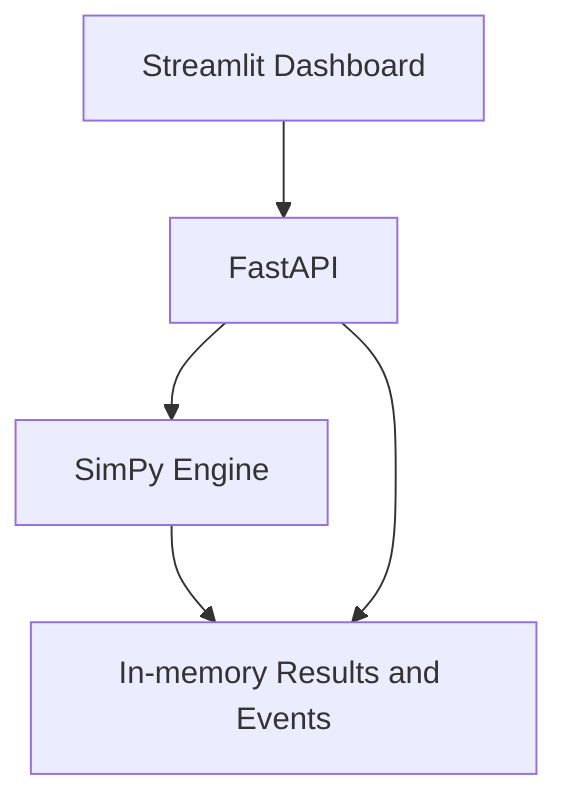

# FabFlow

FabFlow is a reproducible discrete-event simulation platform for studying
wafer-lot dispatching policies and Automated Material Handling System (AMHS)
constraints in a simplified semiconductor manufacturing environment.

The project is designed as an intelligent-manufacturing engineering portfolio
project. It emphasizes deterministic simulation, measurable scheduling
trade-offs, automated testing, API design, visualization, and container deployment.

## Project Status

FabFlow is under active development.

The current implementation provides a deterministic, single-machine,
multi-lot simulation engine built with SimPy. It includes validated domain
entities, FIFO resource queueing, structured lifecycle events, fixed-seed
execution, and automated tests.

### Implemented

- `Lot`, `ProcessStep`, `Machine`, and `Queue` domain entities
- `SimulationScenario` and `MachineConfig` for validated experiment inputs
- `SimulationResult` and immutable `SimulationEvent` records
- Three-stage scenario creation with four machines and five lots
- Normal and hot lot priority classifications
- Lot and machine lifecycle status tracking
- Single-machine capacity enforcement with SimPy
- Lot arrival, queueing, processing, and completion events
- Structured in-memory event logging
- Fixed-seed simulation execution
- Deterministic baseline tests
- Pytest unit tests
- Ruff linting and formatting

### Planned

- FIFO, Shortest Processing Time, and Critical Ratio policy abstractions
- Machine failure and repair behavior
- KPI calculation and policy comparison reports
- Multiple process stages and machine groups
- Simplified AMHS transportation
- FastAPI service
- Streamlit policy comparison dashboard
- Docker Compose deployment for the API and dashboard

## Problem Statement

Semiconductor manufacturing requires production lots to move through multiple
process stages while competing for limited machines and transportation
resources. Dispatching decisions affect cycle time, work in process (WIP),
throughput, equipment utilization, queue waiting time, and on-time delivery.

FabFlow provides a controlled simulation environment for studying these
trade-offs under repeatable experimental conditions. The same scenario and
random seed can be reused across dispatching policies so that results can be
compared fairly.

## Goals

- Build a reproducible discrete-event simulation of lot production and transport.
- Compare dispatching policies using identical scenarios and random seeds.
- Quantify cycle time, throughput, WIP, utilization, and on-time delivery.
- Expose experiment creation and results through a FastAPI service.
- Visualize results and scheduling trade-offs in Streamlit.
- Run the API and dashboard with Docker Compose.

## Planned MVP

- Three process stages: Lithography, Etching, and Inspection
- One to two machines per stage
- Normal lots and high-priority hot lots
- Processing, queueing, transport, machine failure, and repair events
- FIFO, Shortest Processing Time, and Critical Ratio dispatching policies
- Fixed random seeds for reproducible experiments
- FastAPI endpoints to create runs with scenario inputs and query results, events, and metrics
- A Streamlit dashboard comparing FIFO, Shortest Processing Time, and Critical Ratio
- Docker Compose services for the API and Streamlit dashboard

## Current Simulation Flow


The current engine uses a SimPy resource to enforce machine capacity. Lots wait
for that resource in deterministic FIFO request order. Explicit dispatching
policy classes will replace this implicit behavior in a later increment.

## Target Architecture



This diagram represents the target MVP architecture. The API will execute
simulations synchronously and retain results in memory. API endpoints, the
dashboard, and Docker Compose deployment remain planned.

## Current Repository Structure

```text
fabflow/
├── simulator/
│   ├── engine.py
│   ├── entities/
│   │   ├── lot.py
│   │   ├── machine.py
│   │   ├── process_step.py
│   │   ├── queue.py
│   │   └── scenario.py
│   ├── events/
│   │   └── event.py
│   └── scenarios/
│       └── baseline.py
├── tests/
├── docs/
│   ├── baseline-scenario.md
│   └── domain-model.md
├── pyproject.toml
└── README.md
```

## Target Repository Structure

```text
fabflow/
├── app/
│   ├── api/              # HTTP endpoints and request validation
│   ├── core/             # Configuration and shared infrastructure
│   ├── models/           # API request and response models
│   └── services/         # Application use cases
├── simulator/
│   ├── entities/         # Simulation domain entities
│   ├── events/           # Event definitions and event log
│   ├── scenarios/        # Reproducible scenario factories
│   ├── policies/         # Dispatching policies
│   └── metrics/          # KPI calculations
├── dashboard/            # Experiment and comparison interface
├── Dockerfile            # API container
├── docker-compose.yml    # API and dashboard services
├── experiments/          # Controlled experiment definitions
├── tests/                # Unit and integration tests
├── docs/                 # Architecture and domain documentation
├── pyproject.toml
└── README.md
```

## Local Development

### Requirements

- Python 3.12 (the development and CI baseline)
- Git

### Setup

```bash
python3.12 -m venv .venv
source .venv/bin/activate
python -m pip install --upgrade pip
python -m pip install -e ".[dev]"
```

### Verify the Project

Run all automated checks before committing changes:

```bash
ruff format --check .
ruff check .
pytest -v
```

To apply Ruff formatting automatically:

```bash
ruff format .
```

### Create the Three-Stage Scenario

After installation, run from the repository root:

```bash
python -m simulator.scenarios.baseline
```

Expected output:

```text
Scenario: three-stage-baseline
Seed: 42
Stages: 3
Machines: 4
Lots: 5
Route: Lithography -> Etching -> Inspection
```

`SimulationScenario` groups the seed, process steps, machine configurations,
and lots. The example contains two Lithography machines, one Etching machine,
and one Inspection machine, with four Normal lots and one Hot lot. All times
are synthetic and expressed in minutes.

This command creates and describes the scenario. Executing lots through all
three stages remains Day 2 work; the current engine executes a single step on
one machine. Call `create_baseline_scenario()` for fresh lots before each run,
since the lots stored in a scenario are mutable.

### CLI Status

The installed `fabflow` command prints project information. The current
single-machine simulation engine is exercised through automated tests.

## Determinism and Reproducibility

Each simulation engine is initialized with a fixed random seed. The current
baseline contains no stochastic behavior, so its reproducibility comes from
fixed inputs and deterministic SimPy event ordering. Later increments will use
the engine-owned random generator for processing-time variation, machine
failures, and repairs.

Fair policy comparisons will use the same:

- Random seed
- Lot arrival sequence
- Processing-time samples
- Failure and repair samples
- Simulation horizon
- Machine and AMHS configuration

## Core Metrics

The completed MVP will report:

- Average and P95 cycle time
- Throughput
- Work in process
- Queue depth and waiting time
- Machine utilization
- On-time delivery rate
- Transport time and delivery-time accuracy

Metric calculation is planned for a later increment. The current engine records
the timestamps and state transitions needed to derive these measurements.

## Documentation

- [Domain Model](docs/domain-model.md)
- [Hand-Calculated Baseline Scenario](docs/baseline-scenario.md)

## Assumptions and Limitations

FabFlow does **not** use TSMC data or data from any real semiconductor
fabrication facility. All routes, processing times, machine configurations,
failures, transportation times, and events are simplified models based on
public manufacturing concepts or synthetic data.

The MVP does not attempt to reproduce the complete behavior of a real fab. It
excludes hundreds of detailed process steps, complete re-entrant routing,
complex recipe qualification, and real facility path optimization.

## Connection to Intelligent Manufacturing

FabFlow demonstrates how discrete-event simulation, scheduling, visualization,
API design, and container deployment can be combined to evaluate
manufacturing decisions.

The project also explores conceptual similarities between manufacturing
dispatching and computing-resource scheduling, including queues, priorities,
capacity constraints, fairness, and reservations. These are design analogies;
Kubernetes and Apache YuniKorn are not presented as semiconductor AMHS
dispatching systems.

## Roadmap

1. Project foundation, domain models, and three-stage scenario creation
2. Deterministic three-stage simulation engine
3. FIFO, SPT, Critical Ratio, equipment reliability, and KPI comparison
4. Simplified AMHS transportation
5. FastAPI service with synchronous simulation execution
6. Streamlit dashboard, Docker Compose, and end-to-end demo
7. Tests, documentation, and portfolio packaging

## Future Work

The following are outside the seven-day MVP:

- PostgreSQL persistence and database migrations
- Background workers and job queues such as Celery or RQ, with Redis
- Prometheus and Grafana monitoring
- Kubernetes and Kind deployment
- Stocker capacity constraints
- Advanced scheduling and large-scale performance testing

## License

This project is intended for educational and portfolio purposes.
