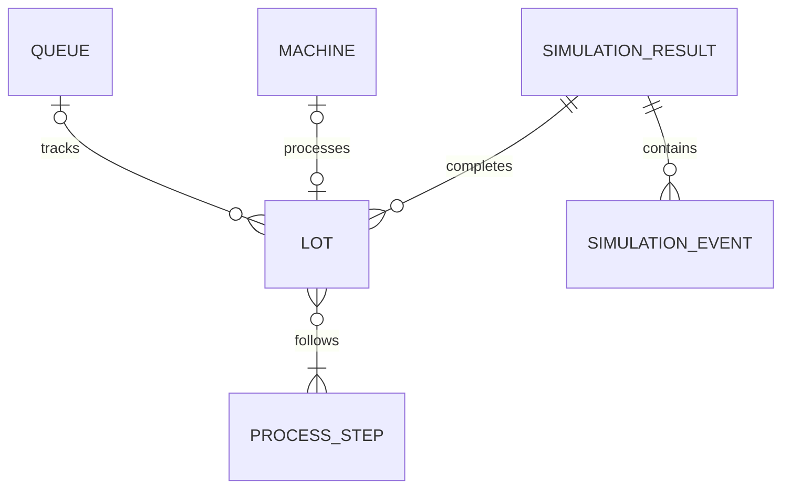

# FabFlow Domain Model

> The sections below record the original single-machine design. For the current
> Day 2 engine, scenario model, event fields, capacity semantics, and execution
> contract, see [Day 2 walkthrough](day2-walkthrough.md). Multi-stage execution
> and `SimulationScenario` are now implemented; advanced policies and KPIs remain planned.

## Purpose

This document defines FabFlow's domain language, implemented simulation model,
and planned extensions. The model is intentionally simplified and evolves in
small, testable increments.

## System Boundary

FabFlow models the flow of synthetic wafer lots through process queues,
machines, stockers, and transportation resources. It evaluates dispatching
decisions and system constraints; it does not reproduce a real fabrication
facility or use proprietary manufacturing data.

## Implementation Boundary

The current increment implements a deterministic, single-machine, multi-lot
simulation. Multiple process stages, policy-based dispatching, stochastic
equipment reliability, AMHS transportation, persistent runs, and KPI reports
remain planned extensions.

## Implemented Domain Entities

| Entity | Responsibility | Implemented Fields |
| --- | --- | --- |
| `Lot` | Represents a wafer lot moving through a route | `lot_id`, `arrival_time`, `due_date`, `route`, `priority`, `current_step`, `status`, `started_at`, `completed_at` |
| `ProcessStep` | Defines one manufacturing operation | `step_id`, `name`, `processing_time`, `eligible_machine_group` |
| `Machine` | Provides finite processing capacity | `machine_id`, `group`, `capacity`, `status`, `current_lot`, `busy_time`, `resource` |
| `Queue` | Tracks lots waiting for processing | `queue_id`, `waiting_lots` |
| `SimulationEvent` | Records a lot lifecycle transition | `timestamp`, `event_type`, `lot_id`, `machine_id`, `queue_depth` |
| `SimulationResult` | Returns the outcome of one engine execution | `finished_at`, `completed_lots`, `events` |

## Planned Domain Entities

| Entity | Responsibility | Planned Fields |
| --- | --- | --- |
| `Stocker` | Temporarily stores lots between operations | `stocker_id`, `capacity`, `location` |
| `TransportJob` | Moves a lot between modeled locations | `job_id`, `lot_id`, `origin`, `destination`, `requested_at`, `delivered_at` |
| `SimulationScenario` | Contains immutable experiment inputs | `seed`, `arrival_rate`, `horizon`, `machine_config`, `amhs_config`, `policy` |
| `SimulationRun` | Tracks one execution of a scenario | `run_id`, `scenario_id`, `status`, `started_at`, `completed_at`, `version` |
| `KPIResult` | Contains calculated experiment results | `cycle_time`, `throughput`, `wip`, `utilization`, `otd`, `dta` |

## Current Entity Relationships



The `Machine` owns a SimPy resource that enforces capacity. A `Queue` records
which lots are waiting, while the simulation engine coordinates state changes
and appends immutable events to the event log.

## Lot

A `Lot` is the primary work item flowing through the simulation.

### Priority

The implemented `LotPriority` values are:

- `LotPriority.NORMAL`
- `LotPriority.HOT`

A hot lot is not automatically selected first. Future dispatching policies
will explicitly define how priority affects selection so that their behavior
remains visible and testable.

### Status

The implemented `LotStatus` lifecycle states are:

- `LotStatus.CREATED`
- `LotStatus.WAITING`
- `LotStatus.PROCESSING`
- `LotStatus.COMPLETED`

A transportation state will be introduced when the AMHS model is implemented.

### Invariants

- `lot_id` must contain at least one non-whitespace character.
- `arrival_time` must be non-negative.
- `due_date` must not be earlier than `arrival_time`.
- A route-dependent operation requires at least one process step.
- `current_step` must reference an available route step while processing.
- A completed lot must not return to processing in the MVP.

The engine or future scenario aggregate will enforce uniqueness of `lot_id`
within a simulation run.

### Derived Values

For a completed lot:

```text
cycle_time = completed_at - arrival_time
```

Before completion, `cycle_time` is undefined.

## Process Step

A `ProcessStep` defines the work required at one point in a lot's route. It
references an eligible machine group rather than a specific machine so that a
future dispatcher can select from multiple compatible machines.

### Invariants

- `step_id` must not be empty.
- `name` must not be empty.
- `processing_time` must be greater than zero.
- `eligible_machine_group` must not be empty.

Process steps are immutable after creation.

## Machine

A `Machine` provides finite processing capacity through a SimPy resource.

### Implemented Status

- `MachineStatus.IDLE`
- `MachineStatus.BUSY`

### Planned Status

- `DOWN`
- `MAINTENANCE`

### Invariants

- `machine_id` must not be empty.
- `group` must not be empty.
- `capacity` must be greater than zero.
- Active processing requests must not exceed machine capacity.
- Processing completion must be recorded exactly once per operation.

The current model records cumulative `busy_time`. MTBF, MTTR, failure, repair,
and maintenance behavior will be introduced in the equipment-reliability
increment.

## Queue

The implemented `Queue` tracks lots waiting for processing. It supports:

- Adding a lot with `enqueue`
- Removing a known lot with `dequeue`
- Reporting the current queue `depth`
- Rejecting duplicate enqueue and invalid dequeue operations

SimPy resource request ordering currently provides deterministic FIFO behavior.
The queue does not yet own a configurable dispatching policy.

## Simulation Engine

The `SimulationEngine` owns:

- A SimPy environment
- A dedicated fixed-seed random-number generator
- An in-memory event log
- A collection of completed lots

For every input lot, the engine schedules a process that:

1. Waits until the lot's arrival time.
2. Records `LOT_ARRIVED`.
3. Adds the lot to the queue and records `LOT_QUEUED`.
4. Requests machine capacity.
5. Removes the lot from the queue and records `PROCESS_STARTED`.
6. Waits for the process step's deterministic processing time.
7. Records `PROCESS_COMPLETED`.
8. Marks the lot complete and records `LOT_COMPLETED`.

The engine returns an immutable `SimulationResult` containing the final
simulation time, completed lots, and ordered events.

## Events

### Implemented Events

| Event | Meaning |
| --- | --- |
| `LOT_ARRIVED` | A lot enters the modeled system |
| `LOT_QUEUED` | A lot enters the processing queue |
| `PROCESS_STARTED` | A machine begins processing a lot |
| `PROCESS_COMPLETED` | A machine finishes an operation |
| `LOT_COMPLETED` | A lot finishes its current simplified route |

Each implemented `SimulationEvent` contains:

- `timestamp`
- `event_type`
- `lot_id`
- Optional `machine_id`
- Optional `queue_depth`

### Planned Events

| Event | Meaning |
| --- | --- |
| `TRANSPORT_REQUESTED` | A lot requests movement |
| `TRANSPORT_COMPLETED` | A lot reaches its destination |
| `MACHINE_FAILED` | A machine becomes unavailable unexpectedly |
| `MACHINE_REPAIRED` | A failed machine becomes available |

A simulation run identifier and extensible structured details will be added
when API execution and persistence are implemented.

## Dispatching Policies

Dispatching policy classes are planned but not implemented in the current
increment.

### FIFO

Select the lot with the earliest queue-entry time. Stable tie-breaking should
use `lot_id` so repeated runs produce the same order.

### Shortest Processing Time

Select the eligible lot with the shortest processing time. Stable tie-breaking
should use queue-entry time and then `lot_id`.

### Critical Ratio

Calculate:

```text
(due_date - current_time) / remaining_processing_time
```

The lowest critical ratio represents the most urgent lot. A value below `1`
indicates that the lot is at risk of missing its due date if current estimates
remain unchanged.

### Future Weighted Priority

```text
score = w1 * urgency
      + w2 * waiting_time
      + w3 * hot_lot_priority
      - w4 * transport_cost
```

Weights belong to the scenario configuration and must be stored with the result
to keep experiments reproducible.

## Stocker and Transport Job

A stocker will represent finite temporary storage. A transport job will
represent the request and delivery of one lot between two modeled locations.

The planned transport model will track:

- Request time
- Pickup time
- Delivery time
- Travel duration
- Available vehicle capacity
- Origin and destination

## Simulation Scenario and Run

A scenario will be an immutable experiment definition. A run will represent one
execution of that definition. Separating them will allow the same scenario to
be repeated or executed using several dispatching policies.

Fair comparisons must use the same:

- Random seed
- Arrival sequence
- Processing-time samples
- Failure and repair samples
- Simulation horizon
- Machine and AMHS configuration

The current deterministic baseline does not sample random values. Its fixed
seed establishes the reproducibility interface that stochastic increments will
use later.

## KPI Definitions

KPI calculation is planned for a later increment. The accepted definitions are:

| KPI | Definition |
| --- | --- |
| Cycle time | `completion_time - arrival_time` for a completed lot |
| Waiting time | Total time a lot spends waiting in queues |
| Throughput | Number of completed lots divided by the stated observation duration |
| WIP | Arrived lots that have not yet completed |
| Utilization | Machine busy time divided by available observation time |
| On-time delivery | Fraction of completed lots with `completion_time <= due_date` |
| Delivery-time accuracy | Difference between predicted and actual transport delivery time |

Metric reports must always state their observation window and treatment of lots
that remain incomplete when the simulation ends.

## Current Acceptance Boundary

The deterministic simulation increment is accepted when it demonstrates:

- One process stage and one machine
- Multiple lots
- Deterministic processing times
- FIFO resource request ordering
- Correct arrival and completion timestamps
- Exactly-once lifecycle event logging
- Zero final queue depth after all lots complete
- Identical output for repeated executions with the same input

Machine failures, multiple stages, AMHS transportation, stockers, alternative
dispatching policies, and aggregate KPI calculation remain outside the current
implementation boundary.
