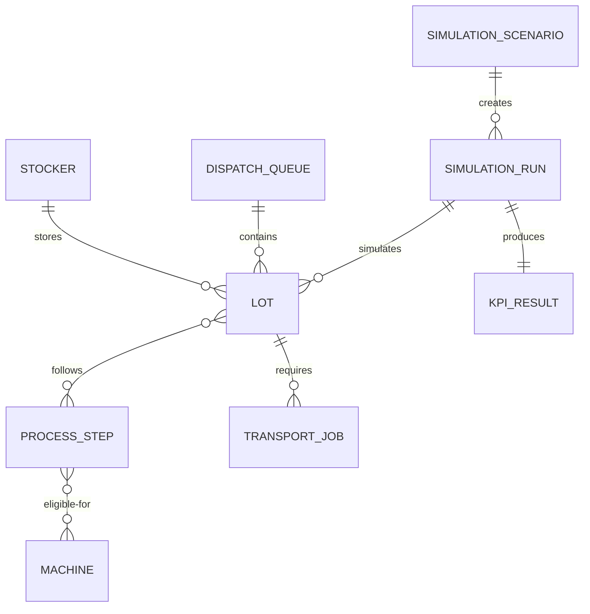

# FabFlow Domain Model

## Purpose

This document defines the initial domain language and boundaries of FabFlow.
The model is intentionally simplified and will evolve incrementally as the
simulation engine is implemented.

## System Boundary

FabFlow models the flow of synthetic wafer lots through process queues,
machines, stockers, and transportation resources. It evaluates dispatching
decisions and system constraints; it does not reproduce a real fabrication
facility or use proprietary manufacturing data.

## Core Entities

| Entity | Responsibility | Important Fields |
| --- | --- | --- |
| `Lot` | Represents a wafer lot moving through a route | `lot_id`, `priority`, `arrival_time`, `due_date`, `route`, `current_step`, `status` |
| `ProcessStep` | Defines one manufacturing operation | `step_id`, `name`, `processing_time`, `eligible_machine_group` |
| `Machine` | Processes an eligible lot | `machine_id`, `group`, `status`, `capacity`, `mtbf`, `mttr`, `current_lot` |
| `DispatchQueue` | Holds lots waiting for processing | `queue_id`, `waiting_lots`, `dispatch_policy` |
| `Stocker` | Temporarily stores lots between operations | `stocker_id`, `capacity`, `location` |
| `TransportJob` | Moves a lot between locations | `job_id`, `lot_id`, `origin`, `destination`, `requested_at`, `delivered_at` |
| `SimulationScenario` | Contains immutable experiment inputs | `seed`, `arrival_rate`, `horizon`, `machine_config`, `amhs_config`, `policy` |
| `SimulationRun` | Tracks one execution of a scenario | `run_id`, `scenario_id`, `status`, `started_at`, `completed_at`, `version` |
| `KPIResult` | Contains calculated experiment results | `cycle_time`, `throughput`, `wip`, `utilization`, `otd`, `dta` |

## Entity Relationships



## Lot

A `Lot` is the primary item flowing through the simulation.

### Priority

The MVP supports:

- `normal`: regular production lot
- `hot`: high-priority lot

A hot lot is not automatically selected first. Each dispatching policy must
explicitly define how priority affects lot selection so that policy behavior
remains testable.

### Status

Planned lot states:

- `created`
- `waiting`
- `transporting`
- `processing`
- `completed`

### Invariants

- `lot_id` must be non-empty and unique within a simulation run.
- `arrival_time` must be non-negative.
- `due_date` must not be earlier than `arrival_time`.
- `current_step` must point to a valid route step.
- A completed lot cannot return to processing in the MVP.

## Process Step

A `ProcessStep` defines the work required at one point in a lot's route. It
references an eligible machine group rather than a single machine, allowing the
dispatcher to select from multiple compatible machines later.

## Machine

### Status

Planned machine states:

- `idle`
- `processing`
- `down`
- `maintenance`

### Invariants

- A machine marked `down` or `maintenance` cannot accept new work.
- A machine's active lot count cannot exceed its capacity.
- Processing completion must be recorded exactly once per operation.

## Dispatch Queue

The queue stores lots that are eligible and waiting for a machine. Queue order
is determined by the configured policy rather than by the collection itself.

## Dispatching Policies

### FIFO

Select the lot with the earliest queue-entry time. Stable tie-breaking should
use `lot_id` so repeated runs return the same order.

### Shortest Processing Time

Select the eligible lot with the shortest processing time. Stable tie-breaking
should use queue-entry time and then `lot_id`.

### Critical Ratio

Calculate:

```text
(due_date - current_time) / remaining_processing_time
```

The lowest critical ratio represents the most urgent lot. A value below `1`
indicates that the lot is at risk of missing its due date if current estimates
remain unchanged.

### Future Weighted Priority

```text
score = w1 * urgency
      + w2 * waiting_time
      + w3 * hot_lot_priority
      - w4 * transport_cost
```

Weights belong to the scenario configuration and must be recorded with the
result to keep experiments reproducible.

## Stocker and Transport Job

A stocker represents finite temporary storage. A transport job represents the
request and delivery of one lot between two modeled locations.

The transport model will eventually track:

- Request time
- Pickup time
- Delivery time
- Travel duration
- Available vehicle capacity
- Origin and destination

## Simulation Scenario and Run

A scenario is an immutable experiment definition. A run is one execution of
that definition. Separating them allows the same scenario to be repeated or
executed using several dispatching policies.

Fair comparisons must use the same:

- Random seed
- Arrival sequence
- Processing-time samples
- Failure and repair samples
- Simulation horizon
- Machine and AMHS configuration

## Events

| Event | Meaning |
| --- | --- |
| `LOT_ARRIVED` | A lot enters the modeled system |
| `LOT_QUEUED` | A lot enters a processing queue |
| `PROCESS_STARTED` | A machine begins processing a lot |
| `PROCESS_COMPLETED` | A machine finishes an operation |
| `TRANSPORT_REQUESTED` | A lot requests movement |
| `TRANSPORT_COMPLETED` | A lot reaches its destination |
| `MACHINE_FAILED` | A machine becomes unavailable unexpectedly |
| `MACHINE_REPAIRED` | A failed machine becomes available |
| `LOT_COMPLETED` | A lot finishes its entire route |

Every event should include at least:

- Simulation timestamp
- Event type
- Simulation run ID
- Relevant entity ID
- Structured event details

## KPI Definitions

| KPI | Initial Definition |
| --- | --- |
| Cycle time | `completion_time - arrival_time` for a completed lot |
| Waiting time | Total time a lot spends waiting in queues |
| Throughput | Number of completed lots divided by the stated observation duration |
| WIP | Arrived lots that have not yet completed |
| Utilization | Machine busy time divided by available observation time |
| On-time delivery | Fraction of completed lots with `completion_time <= due_date` |
| Delivery-time accuracy | Difference between predicted and actual transport delivery time |

Metric reports must always state their observation window and treatment of lots
that remain incomplete when the simulation ends.

## First Implementation Increment

The first deterministic simulator will include only:

- One process step
- One machine
- Multiple lots
- Deterministic processing times
- FIFO dispatching
- Event logging

Machine failures, multiple stages, AMHS transportation, stockers, and
alternative dispatching policies will be added after the baseline simulation
passes its manually calculated acceptance test.
